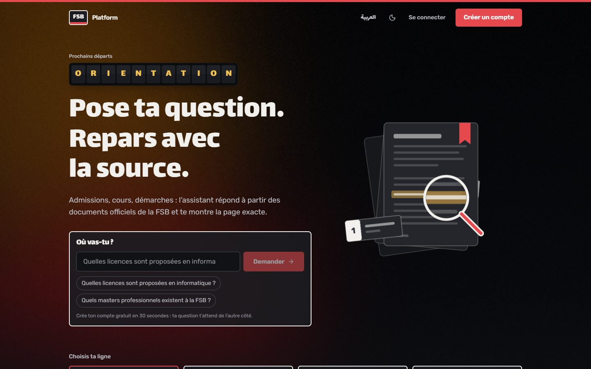
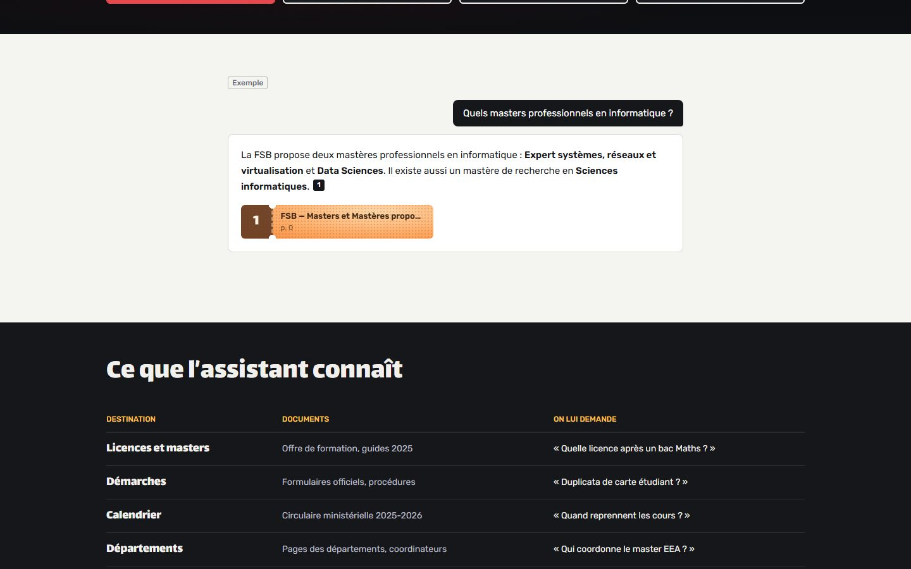
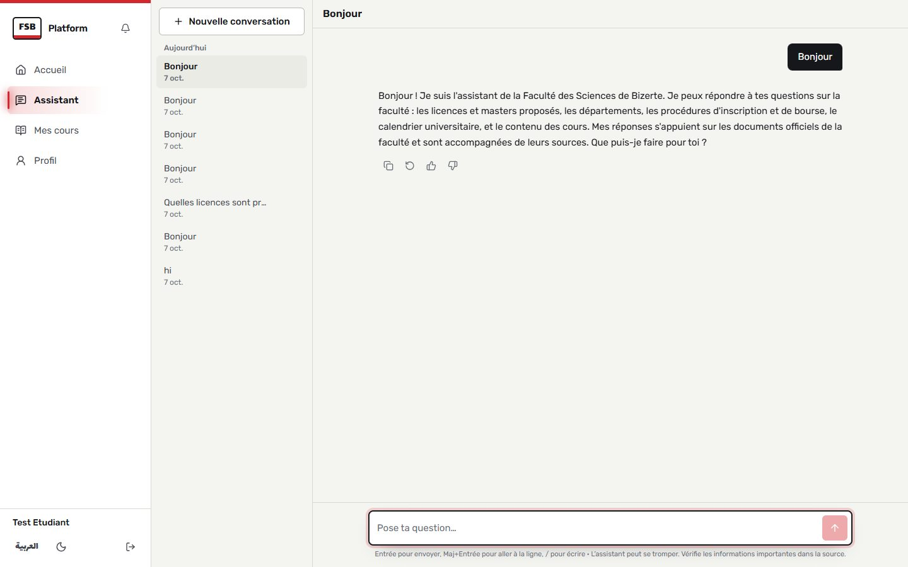
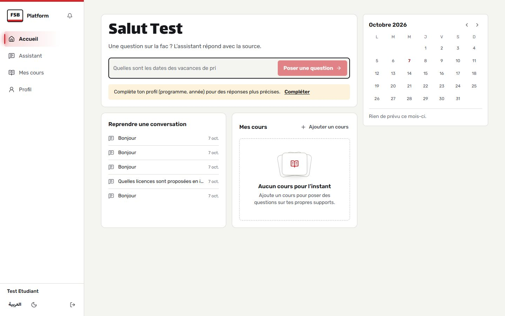
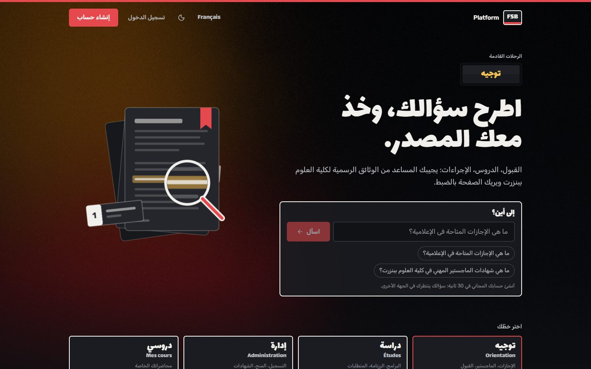
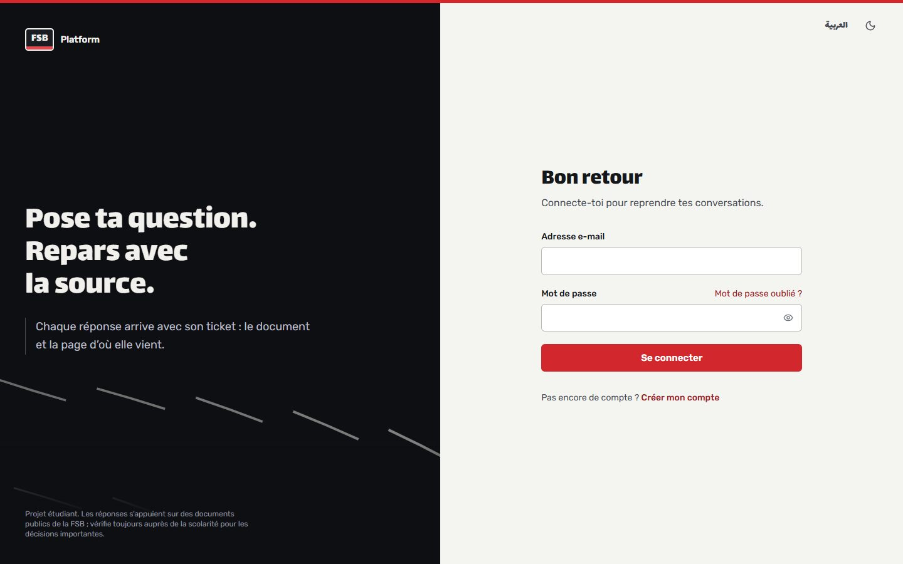
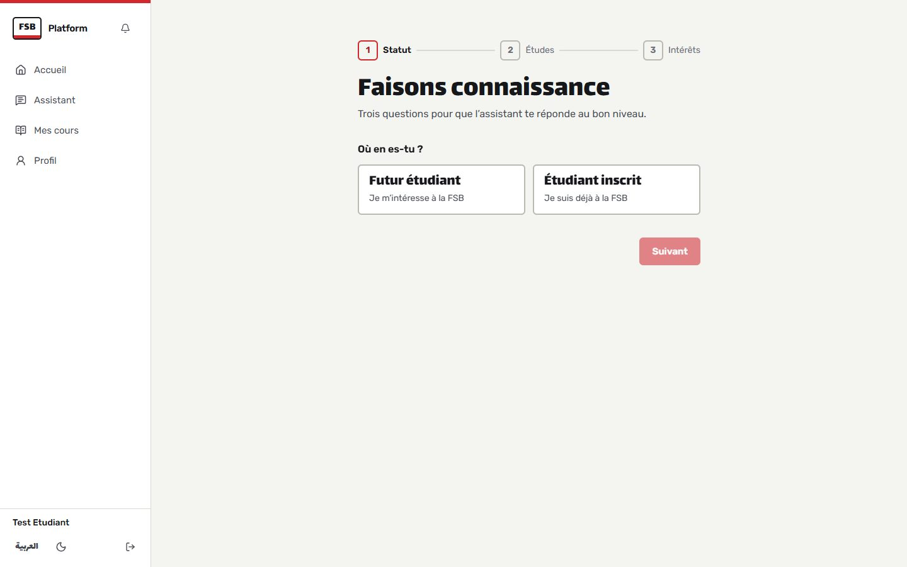
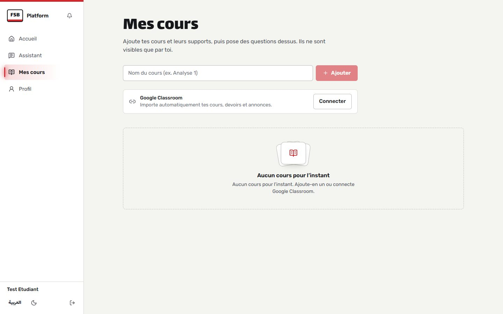
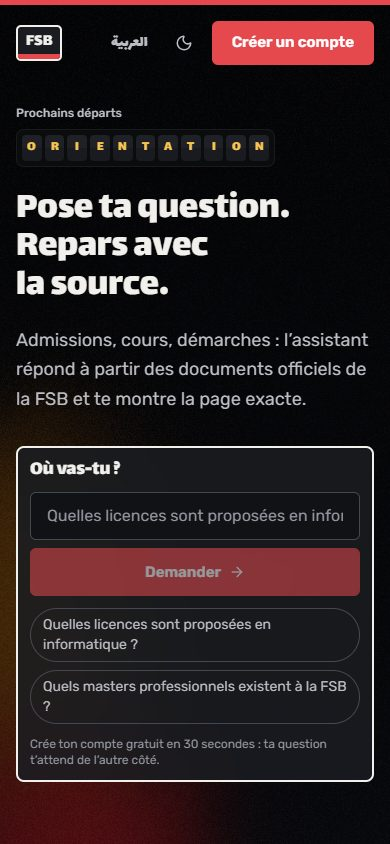
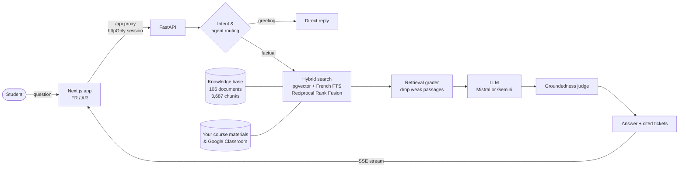

<div align="center">

# 🚏 Platform

### Pose ta question. Repars avec la source.
**اطرح سؤالك، وخذ معك المصدر.**

An AI assistant for the **Faculté des Sciences de Bizerte** that answers students' questions from the faculty's official documents, and always shows the exact document and page it got the answer from.

[](https://github.com/AymenJeddou/digital_campus_platform/actions/workflows/ci.yml)




</div>

---

## Why

Ask a student how they found out about a scholarship deadline, a master's admission rule or the right form for an attestation, and the answer is usually *"a friend who asked the secretariat"*. The information exists, but it is scattered across PDFs, department pages and ministry circulars.

**Platform** puts all of it behind one question box. Every factual answer is **grounded in the faculty's own documents** and comes with its **ticket**: the source document and page, which you can open to read the original passage. When the documents don't cover a question, the assistant says so instead of guessing.

## ✨ Highlights

| | |
|---|---|
| 🎫 **Answers with receipts** | Every claim is cited inline; each source prints as a ticket you can open to read the exact passage. |
| 🧭 **Four lines, one station** | Orientation, Studies, Administration and *My courses*. Questions are routed to the right specialist agent automatically. |
| 🛑 **Honest refusals** | A retrieval grader drops weak passages; a groundedness judge flags or blocks answers the sources don't support. |
| 📚 **Your own courses** | Upload PDF, Word, PowerPoint or text, or sync **Google Classroom**, then ask questions scoped to one course. Private to you. |
| 🌍 **French + Arabic** | Full right-to-left Arabic interface; answers follow the language of the question. |
| 🔔 **Deadlines** | Classroom due dates and official academic-calendar dates in a calendar and a notification bell. |
| 🛠️ **Staff dashboard** | Usage stats, unanswered questions, negative feedback and knowledge-base uploads, to see what's missing. |
| 🌗 **Day and night** | Designed light and dark themes, mobile-first layout, reduced-motion support. |

## 📸 Tour

<table>
  <tr>
    <td width="50%"><br><sub><b>Answers with tickets</b>: the example plays out as a real conversation.</sub></td>
    <td width="50%"><br><sub><b>Assistant</b>: streamed answers, history grouped by date, stop / regenerate / copy / feedback.</sub></td>
  </tr>
  <tr>
    <td><br><sub><b>Dashboard</b>: ask, resume a conversation, deadlines calendar, your courses.</sub></td>
    <td><br><sub><b>العربية</b>: the whole interface mirrors to right-to-left.</sub></td>
  </tr>
  <tr>
    <td><br><sub><b>Sign in</b>: password reset and email verification built in.</sub></td>
    <td><br><sub><b>Onboarding</b>: status, programme and year, so answers fit the student.</sub></td>
  </tr>
  <tr>
    <td><br><sub><b>My courses</b>: add courses, upload materials or sync Classroom.</sub></td>
    <td align="center"><br><sub><b>Mobile</b>: designed for phones first.</sub></td>
  </tr>
</table>

## 🧠 How it works



1. **Route.** Greetings and "what can you do?" get a direct reply. Procedure questions go to the *Administrative* agent, course-scoped ones to *Learning*, enrolled students to *Academic*, everyone else to *Orientation*.
2. **Retrieve.** Hybrid search fuses vector similarity (multilingual embeddings in **pgvector**) with **French full-text search** using Reciprocal Rank Fusion. Course questions also search that student's own materials, and nobody else's.
3. **Filter.** A retrieval grader drops weak passages. If nothing relevant survives, the assistant refuses without calling the LLM.
4. **Generate.** Rules, student profile and retrieved passages go in the **system** message; the student's text stays in the **user** message, so it can't rewrite the rules.
5. **Verify.** A groundedness judge checks the answer against its sources: blocked when unsupported (non-streaming), flagged *"à vérifier"* when streamed.
6. **Cite.** `[Document, p.X]` markers become numbered tickets that open the source passage.

## 📊 Results

Retrieval evaluation on the golden question set ([`knowledge_base/eval`](knowledge_base/eval)):

| Metric | Baseline | **Final** |
|---|---:|---:|
| hit@5 | 0.50 | **0.90** |
| recall@10 | 0.53 | **0.97** |
| MRR | 0.40 | **0.78** |

Plus a **100-question end-to-end test** ([report](docs/FSB_Nexus_100_Question_Test.pdf)): 93 answered, **all 93 with citations**, 7 honest refusals. Full write-up in the [RAG report](docs/FSB_Nexus_RAG_Report.pdf).

## 🔐 Security

- Login token in an **httpOnly cookie** behind a same-origin proxy (never readable by page scripts), revoked on logout.
- **Google Classroom** connect is completed by the signed-in browser (no account-linking CSRF); tokens encrypted at rest; disconnect revokes the grant.
- Rate limits on login (per IP **and** per account), chat and password reset. Message size caps, upload limits and zip-bomb checks.
- Profile fields that reach the prompt are validated; student text never sits inside the instructions.
- Students only ever retrieve the global knowledge base plus **their own** course materials.

## 🎨 Design

The identity is **the louage station**: the shared-taxi station every Tunisian student knows. Questions board a *line*, answers arrive with their *ticket*. Hand-painted bilingual placards (Lalezar + Rubik, both Arabic and Latin), one louage-red band, sodium-amber night lights. Components include a split-flap departure board, a WebGL hero, ticket stubs with tilt and glare, and a "limelight" nav. All effects are CSS or vanilla JS and respect `prefers-reduced-motion`. Full system in [`DESIGN.md`](DESIGN.md), product brief in [`PRODUCT.md`](PRODUCT.md).

## 🧰 Tech stack

| Layer | Tools |
|---|---|
| Frontend | Next.js 16 (App Router), React 19 + React Compiler, Tailwind CSS 4, react-markdown, lucide, sonner |
| Backend | FastAPI, SQLAlchemy 2.1, Alembic, PostgreSQL 16 + **pgvector**, Redis (rate limits), PyJWT + bcrypt |
| AI | sentence-transformers (multilingual MPNet), Mistral or Google Gemini (`google-genai`), hybrid RRF search |
| Integrations | Google Classroom + Drive (OAuth, background sync), SMTP for verification and reset links |
| Quality | pytest (≈100 tests), ESLint, TypeScript, GitHub Actions CI with Alembic up/down checks and dependency audits |

## 🚀 Quick start

```bash
# 1. Database + Redis
docker compose up -d                                  # Postgres :5433, Redis :6379

# 2. Python (backend + AI share one venv)
python -m venv .venv && . .venv/Scripts/activate      # macOS/Linux: source .venv/bin/activate
pip install torch==2.14.1 --index-url https://download.pytorch.org/whl/cpu
pip install -r backend/requirements.txt -r ai/requirements.txt

# 3. Configuration
cp backend/.env.example backend/.env                  # set SECRET_KEY
cp ai/.env.example ai/.env                            # set MISTRAL_API_KEY (or Gemini)
cp frontend/.env.example frontend/.env.local

# 4. Schema + knowledge base
cd backend && alembic upgrade head && cd ..
python scripts/ingest_kb.py                           # embeds the 3,687 chunks (first run downloads the model)

# 5. Run
cd backend && PYTHONPATH=.. uvicorn app.main:app --port 8000      # terminal 1
cd frontend && npm install && npm run dev                          # terminal 2
```

Open **http://localhost:3000**. Accounts are auto-verified in development (`AUTO_VERIFY_EMAIL=true`). The full guide, including admin access and production notes, is in [`RUNNING_LOCALLY.md`](RUNNING_LOCALLY.md).

## 🗺️ API at a glance

| Area | Endpoints |
|---|---|
| Auth | `POST /auth/register` · `/verify` · `/resend-verification` · `/login` · `/logout` · `/forgot-password` · `/reset-password` |
| Profile | `GET/PATCH /profile` · `POST /profile/onboarding` · `GET /programs` |
| Chat | `POST /chat` · `POST /chat/stream` (SSE) · `GET /chat/sessions` · `PATCH/DELETE /chat/sessions/{id}` · `GET /chat/sessions/{id}/messages` · `POST /chat/feedback` · `GET /sources` |
| Courses | `GET/POST /courses` · `/courses/mine` · `/courses/{id}` · materials (text + upload) · `/courses/classroom/*` |
| Other | `GET /notifications` · `/admin/stats` · `/admin/unanswered` · `/admin/feedback` · `/documents` (admin) |

Interactive docs at **http://localhost:8000/docs** while the backend runs.

## 📁 Project structure

```
├── frontend/          Next.js app: pages, /api proxy, design system (components/fx)
├── backend/           FastAPI: routes, models, Alembic migrations, services, tests
├── ai/                RAG pipeline: agents, prompts, hybrid search, graders, LLM client
├── src/search/        Retriever seam used by the pipeline
├── knowledge_base/    Source documents, cleaning/chunking pipeline, eval sets and reports
├── scripts/           Knowledge-base ingestion, guarded database reset
└── docs/              Reports, deployment guide, screenshots
```

## 🧪 Tests

```bash
python -m pytest ai/tests -q                                   # RAG pipeline (no API key needed)
cd backend && PYTHONPATH=.. python -m pytest tests -q          # API (needs Postgres)
cd frontend && npm run lint && npm run typecheck && npm run build
```

CI runs all three on every pull request.

## 📚 Documentation

- [Running locally](RUNNING_LOCALLY.md) · [Design system](DESIGN.md) · [Product brief](PRODUCT.md)
- [RAG evaluation report](docs/FSB_Nexus_RAG_Report.pdf) · [100-question test](docs/FSB_Nexus_100_Question_Test.pdf)
- [Changes & deployment guide](docs/Digital_Campus_Changes_and_Deployment_Guide.pdf) · [Internship report](docs/Digital_Campus_Internship_Report_2026.pdf)

---

<div align="center">
<sub>A student project for the Faculté des Sciences de Bizerte. Answers come from public FSB documents; always confirm important decisions with the faculty's administration.</sub>
</div>
